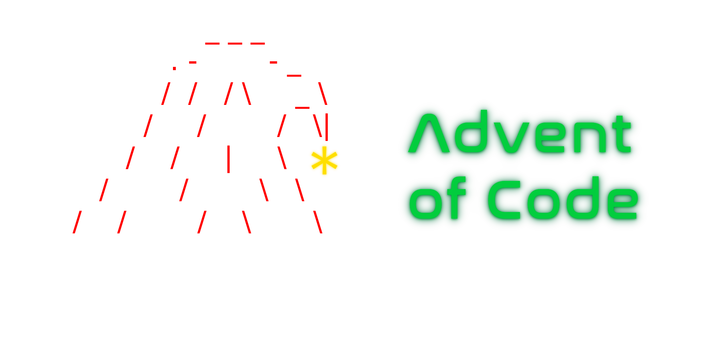

<p align="center">
  
</p>

---

<div align="center">

  <a href="https://www.python.org/"></a>
  <a href="https://fr.wikipedia.org/wiki/C_(langage)"></a>
  <a href="https://www.typescriptlang.org/"></a>
  <a href="https://fr.wikipedia.org/wiki/C%2B%2B"></a>
<div>
  <span><i>Powered with :sparkling_heart: by </span>
  <a href="https://www.epitech.eu/"></a>
  <sup>Nice</i></sup>
</div>
</div>

## 📋 Table of Contents
* [🎄 What's the Advent Of Code](#about)
* [🚀 Usage](#usage)
    * [ Python](#about-python)

    * [ C](#about-c)

    * [ Typescript](#about-ts)

    * [ C++](#about-cpp)

    * [ Php](#about-php)

## 🎄 What's the Advent Of Code

Advent of Code is an Advent calendar of small programming puzzles for a variety of skill sets and skill levels that can be solved in any programming language you like.

## 🚀 Usage
###  <a name="about-python">Python</a>

```bash
python3 DayXX/Python/main.py
```

###  <a name="about-c">C</a>

```bash
gcc DayXX/C/main.c -o dayXX
./dayXX
```

###  <a name="about-ts">Typescript</a>

```bash
tsc DayXX/TS/main.ts
node dayXX.js
```

###  <a name="about-cpp">C++</a>

```bash
g++ DayXX/CPP/main.cpp -o dayXX
./dayXX
```